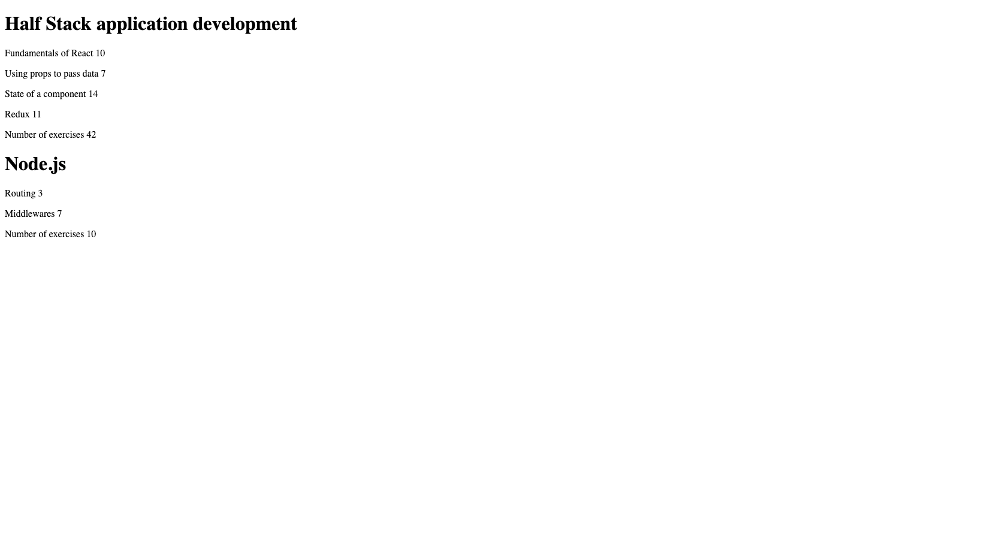
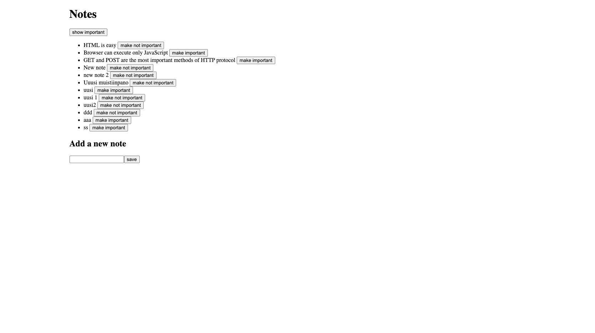

# AI-Assisted Software Development

This repository contains hands-on exercises built while learning AI-assisted development workflows in Visual Studio Code and modern frontend development with React, Svelte, and Vite.

The projects are organized by topic and course part, ranging from small JavaScript basics to multi-component React apps with a mock backend.

## Repository Structure

```text
.
├── 01-visual-studio-copilot/
│   └── 01-harjoitus/
│       └── summa.js
└── 02-ai-full-stack-open/
	├── osa0/
	├── osa1/
	│   ├── 02-ai-kurssitiedot/         # React: course information
	│   ├── 03-kurssitiedot-svelte-2/   # Svelte: course information
	│   ├── 04-ai-unicafe/              # React: feedback/statistics app
	│   └── 05-ai-anekdootit/           # React: anecdotes and voting
	└── osa2/
		├── 06-ai-puhelinluettelo/      # React + JSON Server: phonebook CRUD
		└── 07-ai-notes/                # React + JSON Server: notes app
```

## Projects Overview

### 01 Visual Studio Copilot

- `01-harjoitus/summa.js`: a simple JavaScript sum function.

### 02 AI Full Stack Open

#### Part 1

- `02-ai-kurssitiedot` (React): renders courses and calculates total exercises.
- `03-kurssitiedot-svelte-2` (Svelte): Svelte variant of the course information task.
- `04-ai-unicafe` (React): collects feedback (`good/neutral/bad`) and computes statistics.
- `05-ai-anekdootit` (React): random anecdote selector with voting and most-voted display.

#### Part 2

- `06-ai-puhelinluettelo` (React + Axios + JSON Server): phonebook with create, update, delete, filter, and notifications.
- `07-ai-notes` (React + Axios + JSON Server): notes app with add, filter important/all, and importance toggle.

## Tech Stack

- JavaScript (ES Modules)
- React 19 + Vite
- Svelte 5 + Vite
- Axios
- JSON Server
- ESLint

## Getting Started

Each app is standalone. Open the app directory and run it independently.

### 1) Install dependencies

```bash
npm install
```

### 2) Start development server

```bash
npm run dev
```

### 3) Apps with mock backend (Part 2)

For `06-ai-puhelinluettelo` and `07-ai-notes`, run the frontend and JSON Server in separate terminals:

```bash
npm run server
npm run dev
```

Default mock API port: `3001`.

## Screenshots (Latest Commit)

These screenshots were added in the latest commit and are embedded directly from each app's `public` folder.

### Kurssitiedot



### Unicafe


### Anekdootit


### Puhelinluettelo


### Notes



## Notes

- Screenshot files are currently stored directly under each app's `public` folder.

## 👤 Author

GitHub: https://github.com/1967cooder

### Contacts

LinkedIn: https://www.linkedin.com/in/silvanalindholm

Email: silvanalindholm@hotmail.com

✅ This project is intended for educational and demonstration purposes.
